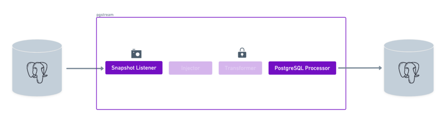
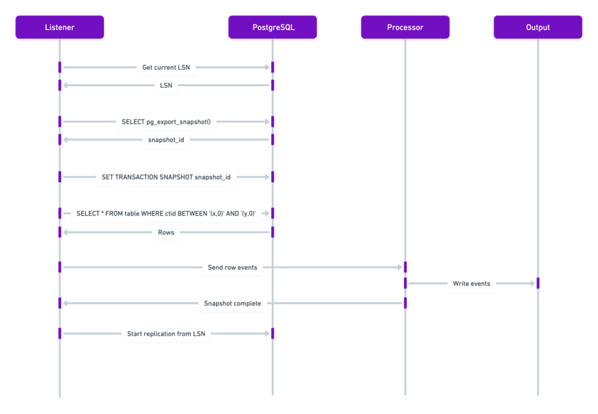

# 📷 Snapshots



`pgstream` supports the generation of PostgreSQL schema and data snapshots. It can be done as an initial step before starting the replication, or as a standalone mode, where a snapshot of the database is performed without any replication.

The snapshot behaviour is the same in both cases, with the only difference that if we're listening on the replication slot, we will store the current LSN before performing the snapshot, so that we can replay any operations that happened while the snapshot was ongoing.

The snapshot implementation is different for schema and data.

- Schema: it relies on `pg_dump` to produce the dump of the schema to be snapshotted. For Postgres targets it relies on `pg_restore` for restoring the schema, while for other targets it emits DDL events into the WAL pipeline to be processed.

- Data: it relies on transaction snapshot ids to obtain a stable view of the database tables, and paralellises the read of all the rows by dividing them into ranges using the `ctid`.



## ⚠️ The data snapshot source must be a single instance

The data snapshot exports a transaction snapshot on one connection and imports it
(`SET TRANSACTION SNAPSHOT`) on the parallel worker connections to give every worker the
same stable view. An exported snapshot is **instance-local**, so this only works when every
connection reaches the *same* Postgres instance.

Do **not** point the snapshot source at a load-balanced endpoint that spans multiple
instances, such as:

- an Amazon **Aurora reader (`cluster-ro`) endpoint** or an **RDS reader endpoint**,
- a connection **pooler that spreads connections across multiple database instances**.

Against such an endpoint the worker connections can land on a different instance than the
one that exported the snapshot, and the snapshot fails — nondeterministically, depending on
how connections happen to be routed — with:

```
setting transaction snapshot: relation does not exist: snapshot "…" does not exist
```

Use a **single-instance / writer endpoint** for the snapshot source. A connection pooler in
front of a *single* instance (e.g. RDS Proxy to one instance, or pgbouncer to one server) is
fine.

> `pgstream check` includes a preflight check that probes the source and reports a clear
> error when it detects a load-balanced source, so you can catch this before a snapshot runs.

To keep snapshot load off a primary that cannot afford it, the snapshot can be taken from a physical read replica instead. See [Running pgstream from a read replica](replicas.md).

## ⚠️ Resetting the target destroys it before the new data lands

`clean_target_db` (the `--reset` flag, `PGSTREAM_POSTGRES_SNAPSHOT_CLEAN_TARGET_DB`) drops the
in-scope target objects after the source schema is dumped but **before** the table data is
copied, and the restore is neither staged nor transactional.

So anything that fails after that point — a load-balanced source (see above), a transient
error, an interrupted run — leaves the target with the new schema and incomplete or no data,
and the previous contents are not recoverable. A scheduled snapshot re-drops the target on
every retry. Treat a non-zero exit as "the target is now unusable", not "nothing happened".

To keep a good copy, snapshot into a **new, empty database** (`create_target_db: true`, target
URL naming it) and repoint consumers only once the run has succeeded. An empty target has
nothing to drop, so `clean_target_db` isn't needed there.

For more details into the snapshot implementation and performance benchmarking, check out this [blogpost](https://xata.io/blog/behind-the-scenes-speeding-up-pgstream-snapshots-for-postgresql). For details on how to use and configure the snapshot mode, check the [snapshot tutorial](tutorials/postgres_snapshot.md).
